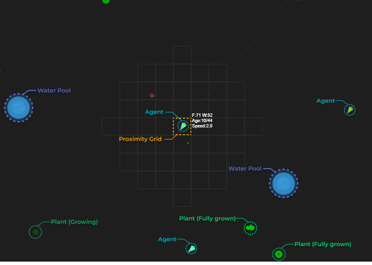

# 🌱 Hydro-phage: Ecosystem Simulation

A miniature ecosystem where autonomous agents survive, adapt, and evolve in a closed environment. Watch tiny digital creatures as they search for food and water, make decisions, and shape the next generation.

🔗 **Live Preview:** [https://tahmid406.github.io/Hydro-phage/](https://tahmid406.github.io/Hydro-phage/)

---

## ✨ Features

- **Autonomous Agents** – Self-governing entities with survival instincts  
- **Resource Management** – Dynamic food and water systems  
- **Emergent Behavior** – Complex patterns from simple rules  
- **Grid-Based Optimization** – Efficient spatial queries for smooth performance  
- **Handcrafted Logic** – No external AI libraries – pure vector math and logic  

---

## 🎯 How It Works

### Agents

Each agent is an autonomous creature with:

- **Position & Velocity** – For natural movement
- **Internal Resources** – Food and water that decay over time
- **Memory System** – Remembers water locations
- **Decision Making** – Chooses to wander, eat, drink, or rest based on needs

<!-- Add: labeled image showing what object is which -->

---

### Environment

- **Plants** – Stationary food sources with limited nutrition
- **Water Pools** – Hydration sources distributed near the arena center
- **Grid System** – Optimized for proximity checks and spatial updates

---

### Behavior System

<!-- Add: Flowchart of agent AI here -->

Agents follow a simple yet effective behavior logic:

- Drink water if hydration < 50%
- Seek food if food < 75%
- Use memory to find known water spots
- Wander when all needs are met

---

## 🚀 Current Development

### ✅ Active Features

- Agent survival mechanics
- Resource consumption and depletion
- Spatial memory and decision system
- Optimized grid-based world

### 🔄 Coming Soon

- Agent reproduction when resources are abundant  
- Aging, death, and population cycling  
- Nesting behavior with food/water storage  
- Evolution through mutation: speed, sensing, efficiency  

---

## 🔮 Future Vision

- 🦁 **Predator Agents** – Hunt other agents for survival  
- 🏠 **Resource Gathering** – Build shelters for safety and nesting  
- ⚔️ **Faction System** – Group-based dynamics, alliances, and territory wars  

---

## 🤝 Contributing

Have ideas? Found a bug? Contributions are welcome — feel free to open issues or submit pull requests!
