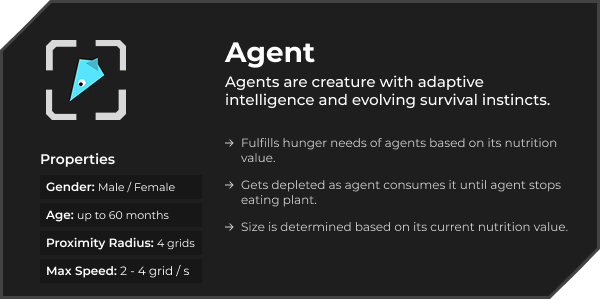
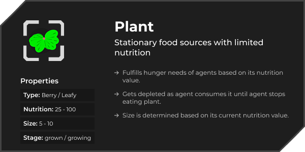
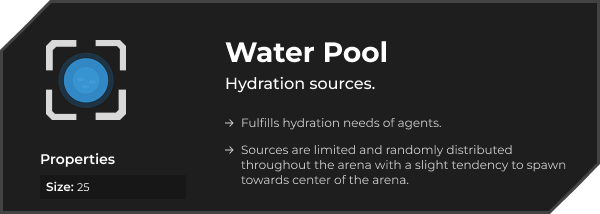
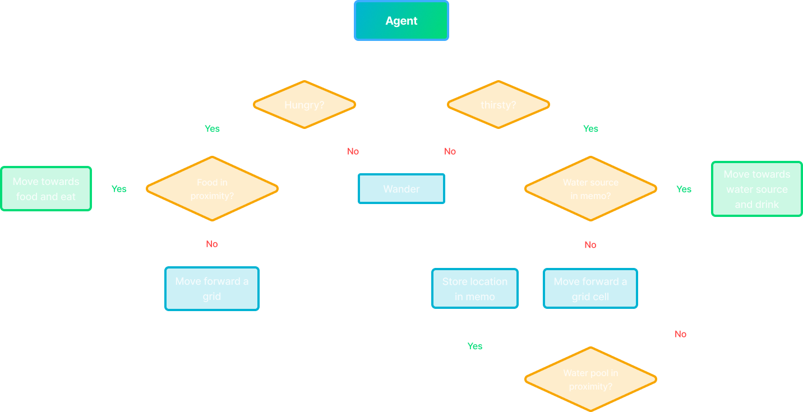

# 🌱 Hydro-phage: Ecosystem Simulation

A miniature ecosystem where autonomous agents survive, adapt, and evolve in a closed environment. Watch tiny digital creatures search for food and water, make decisions, and shape the next generation.

🔗 **Live Preview:** [https://tahmid406.github.io/Hydro-phage/](https://tahmid406.github.io/Hydro-phage/)

---

## ✨ Features

- **Autonomous Agents** – Self-governing entities with survival instincts
- **Resource Management** – Dynamic food and water systems
- **Emergent Behavior** – Complex behaviors for survival from simple rules
- **Grid-Based Optimization** – Efficient spatial queries for smooth performance
- **Handcrafted Logic** – No external AI libraries – pure vector math and logic

---

## 📘 World Entities

---

### Behavior System

Agents follow a simple but expressive decision tree:

📊  

---

### ✅ Active Features

- Survival mechanics (food, water, aging)
- Reproduction with cooldowns and pairing
- Simple spatial memory
- Optimized grid-based updates

### 🔄 Coming Soon

- Nesting behavior and shared resource zones
- Mutation-driven evolution (speed, efficiency, memory)
- More expressive social interactions

---

## 🔮 Future Vision

- 🦁 Predator agents with hunting behavior
- 🏠 Shelter and territory systems
- ⚔️ Factions with alliances, conflict, and dominance

---

## 🤝 Contributing

Have ideas or feedback? Found a bug?  
Contributions are welcome – feel free to open an issue or submit a PR!

---
